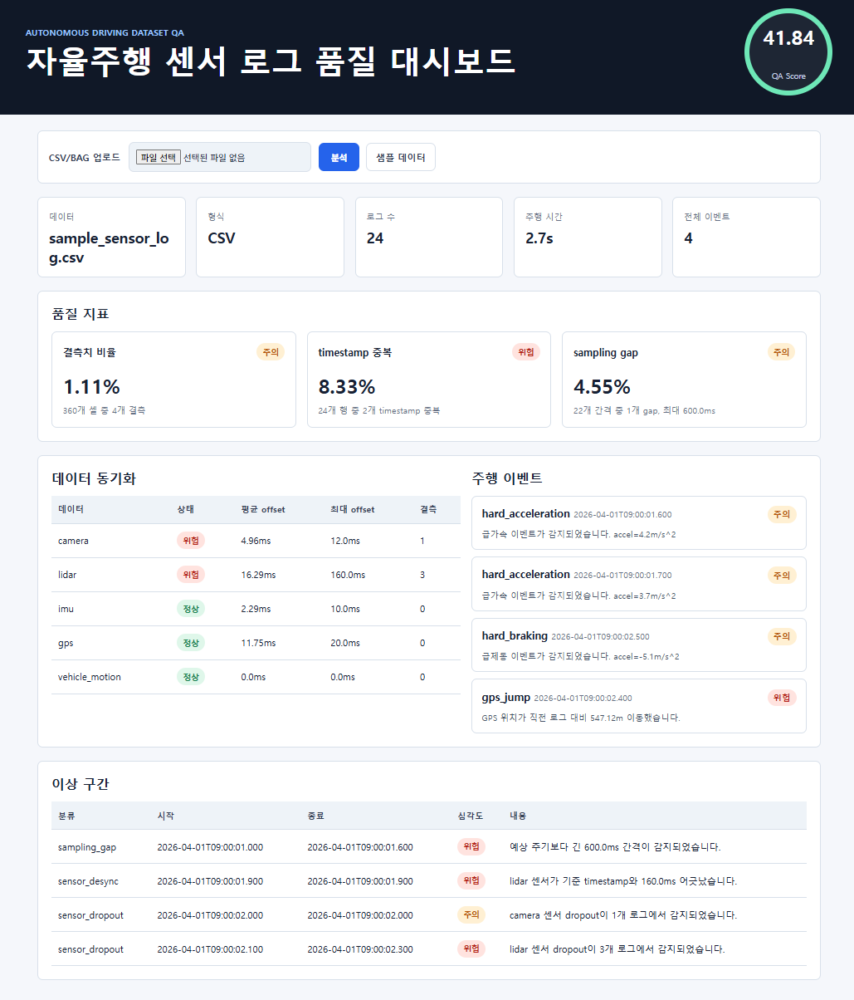

# 자율주행 센서 로그 QA 대시보드



자율주행 주행 로그 CSV 또는 ROS bag 파일을 분석하여 센서 품질, 동기화 상태, 이상 구간, 주행 이벤트를 자동으로 요약하는 웹 서비스입니다.

## 서비스 시작

Render에 배포된 서비스는 아래 주소에서 바로 확인할 수 있습니다.

서비스 주소: https://autodriving-dataset-qa-dashboard.onrender.com/

Render 무료 인스턴스는 일정 시간 요청이 없으면 sleep 상태가 될 수 있어 첫 접속이 느릴 수 있습니다. 공개 배포 환경은 데모와 CI/CD 검증용으로 사용하고, 대용량 bag 파일 검증은 로컬 Docker 실행을 권장합니다.

## 주요 목표

- 센서 로그의 결측치, timestamp 이상, sampling gap을 검사합니다.
- camera, lidar, imu, gps, 차량 움직임 명령(cmd_vel)의 동기화 상태를 요약합니다.
- 급가속, 급제동, GPS jump, 센서 dropout 이벤트를 탐지합니다.
- ROS bag 파일의 토픽 주기, 메시지 수, 핵심 데이터 스트림 커버리지, timestamp gap을 검사합니다.
- GitHub Actions, Docker, Render 배포 흐름을 연결할 수 있는 구조로 개발합니다.

## 기술 스택

- Python
- FastAPI
- Pandas
- Pytest
- Rosbags
- Docker
- GitHub Actions
- Render

## 로컬 빠른 시작

로컬에서 직접 실행할 때는 Docker를 사용합니다. Windows, macOS, Linux, WSL 모두 같은 컨테이너 환경으로 실행할 수 있어 Python 버전과 패키지 설치 차이를 줄일 수 있습니다.

### 준비

- Windows/macOS: Docker Desktop 설치
- Linux/WSL: Docker Engine 또는 Docker Desktop WSL integration 사용

### 실행

```bash
git clone https://github.com/Donok53/autodriving_dataset_QA_dashboard.git
cd autodriving_dataset_QA_dashboard

docker build -t autodriving-sensor-qa .
docker run --rm -p 8000:8000 autodriving-sensor-qa
```

브라우저에서 `http://localhost:8000`으로 접속합니다. 컨테이너 시작 시 `Local Docker Browser URL` 안내가 먼저 출력됩니다.
Uvicorn 로그에 표시되는 `http://0.0.0.0:8000`은 컨테이너 내부 수신 주소이며, 브라우저 접속 주소로는 `localhost`를 사용합니다.

상태 확인은 아래 주소에서 할 수 있습니다.

```text
http://localhost:8000/health
```

Windows에서 접속이 안 되면 서버를 실행한 PowerShell은 그대로 둔 상태에서 새 PowerShell을 열고 아래 명령으로 응답을 확인합니다.

```powershell
curl.exe http://localhost:8000/health
```

## 개발 및 테스트

코드를 수정하거나 테스트를 직접 실행할 때만 Python 가상환경을 사용합니다.

### macOS/Linux/WSL

```bash
python3 -m venv .venv
source .venv/bin/activate
python -m pip install --upgrade pip
pip install -r requirements.txt

pytest
uvicorn app.main:app --host 0.0.0.0 --port 8000
```

Ubuntu, Debian, WSL에서 `externally-managed-environment` 오류가 발생하면 아래 패키지를 설치한 뒤 다시 가상환경을 생성합니다.

```bash
sudo apt update
sudo apt install -y python3-full python3-venv
```

### Windows PowerShell

```powershell
py -3 -m venv .venv
.\.venv\Scripts\Activate.ps1
python -m pip install --upgrade pip
pip install -r requirements.txt

pytest
uvicorn app.main:app --host 0.0.0.0 --port 8000
```

<details>
<summary>WSL에서 Uvicorn은 실행되는데 브라우저 접속이 안 될 때</summary>

`0.0.0.0`은 접속 주소가 아니라 모든 네트워크 인터페이스에서 요청을 받겠다는 의미입니다. 먼저 WSL 터미널 안에서 서버가 정상 응답하는지 확인합니다.

```bash
curl http://127.0.0.1:8000/health
```

정상이라면 Windows 브라우저에서 `http://localhost:8000` 또는 `http://127.0.0.1:8000`으로 접속합니다. 그래도 안 되면 WSL IP를 확인합니다.

```bash
hostname -I
```

출력된 IP를 사용해 Windows 브라우저에서 `http://WSL_IP:8000` 형식으로 접속합니다.

</details>

<details>
<summary>대용량 bag 파일을 로컬에서 검증할 때</summary>

대용량 bag 업로드를 로컬에서 테스트할 때는 SSD/NVMe 경로에 임시 저장하는 구성을 권장합니다. 기본값은 프로젝트의 `runtime/uploads`입니다.

```bash
./scripts/run_local_server.sh
```

기본 설정은 업로드 파일 1개당 10GB, 동시 업로드 임시 저장소 250GB입니다. 임시 파일은 분석 완료 후 삭제됩니다.

포트나 저장 위치를 바꾸려면 실행 전에 환경 변수를 지정합니다.

```bash
APP_PORT=8080 \
UPLOAD_HOST_DIR=./runtime/uploads \
./scripts/run_local_server.sh
```

</details>

## DevOps 파이프라인

이 저장소는 다음 흐름으로 개발과 배포를 연결합니다.

```text
Git push
  -> GitHub Actions
  -> pytest
  -> Docker image build
  -> Render Docker Web Service
```

CI 워크플로는 `.github/workflows/ci.yml`에 정의되어 있으며, push 또는 pull request가 발생하면 테스트와 Docker 빌드 검증을 자동으로 수행합니다.

Render 배포는 `render.yaml`을 기준으로 Docker Web Service를 생성하고, `/health` 엔드포인트를 health check로 사용합니다.

## Render 배포

1. Render에서 New Web Service를 선택합니다.
2. GitHub 저장소 `Donok53/autodriving_dataset_QA_dashboard`를 연결합니다.
3. 배포 방식은 Docker를 선택합니다.
4. 배포가 끝나면 `/health`와 `/api/sample-analysis`로 실행 상태를 확인합니다.

현재 배포 주소는 `https://autodriving-dataset-qa-dashboard.onrender.com/`입니다. HTTPS 인증서는 Render가 자동으로 관리합니다.

무료 Render Web Service는 리소스가 작기 때문에 공개 데모와 CI/CD 검증용으로 사용합니다. `render.yaml`에는 Render 환경에서 파일 1개당 100MB, 동시 업로드 임시 저장소 300MB 제한을 적용했습니다. 대용량 bag 검증은 로컬 Docker 실행 환경에서 확인하는 것을 권장합니다.

Render 무료 인스턴스의 주요 제약은 다음과 같습니다.

- 512MB RAM, 0.1 CPU
- 15분 동안 요청이 없으면 sleep 상태로 전환
- 재시작, redeploy, sleep 이후 로컬 임시 파일 유지 보장 없음
- 무료 Web Service는 persistent disk 미지원

## 운영 로그와 자동 이슈 생성

애플리케이션은 요청 처리, 업로드 작업, 분석 작업의 주요 상태를 표준 로그로 남깁니다. Render에서는 서비스의 Logs 화면에서 `error`, `warning`, `job_id`, `request_id` 같은 키워드로 검색할 수 있습니다.

예상하지 못한 서버 오류가 발생했을 때 GitHub issue를 자동으로 만들고 싶다면 Render 환경 변수에 아래 값을 추가합니다. 잘못된 파일 업로드나 스키마 오류처럼 사용자가 만든 입력 오류는 Render 로그에만 남기고, GitHub issue는 만들지 않습니다.

```text
AUTO_CREATE_GITHUB_ISSUES=true
GITHUB_ISSUE_REPOSITORY=Donok53/autodriving_dataset_QA_dashboard
GITHUB_ISSUE_TOKEN=github_pat_...
GITHUB_ISSUE_LABELS=bug
AUTO_ISSUE_COOLDOWN_SECONDS=3600
AUTO_ISSUE_MAX_PER_RUNTIME=5
```

`GITHUB_ISSUE_TOKEN`은 GitHub fine-grained personal access token을 사용하고, 대상 저장소에 대한 Issues 읽기/쓰기 권한만 부여합니다. 이 값은 Render의 Secret 환경 변수로만 저장하고 Git에 커밋하지 않습니다.

자동 이슈에는 오류 타입, Render 서비스명, 배포 commit, job/request context, traceback이 포함됩니다. 업로드 파일명과 임시 파일 경로는 공개 issue에 노출되지 않도록 제외하거나 축약합니다.

## 분석 항목

파일 업로드 시 브라우저에서 업로드 진행률을 표시하고, 서버 분석은 인메모리 job 상태를 통해 검사 진행률을 표시합니다. 분석이 끝나면 완료된 job 결과 페이지로 이동합니다.

### CSV 로그

- 결측치 비율
- timestamp 중복
- sampling gap
- 센서 timestamp 동기화 offset
- 센서 dropout 구간
- 급가속 및 급제동 이벤트
- GPS 위치 jump 이벤트

### ROS bag 파일

- bag 전체 메시지 수와 주행 시간
- 토픽별 메시지 수, 추정 주파수, 중앙 주기, 최대 gap
- camera, lidar, imu, gps, vehicle_motion 계열 토픽 커버리지
- 핵심 데이터 스트림 누락 여부
- 데이터 스트림 간 nearest timestamp offset
- 차량 움직임 명령(cmd_vel) 토픽 누락 여부
- IMU 수평 가속도 이벤트
- GPS 위치 jump 이벤트

bag 분석은 `rosbags` 라이브러리를 사용하여 ROS 설치 없이 ROS1 `.bag` 파일을 읽는 방식으로 구성했습니다.

대용량 bag 파일은 브라우저 업로드와 임시 저장에 시간이 오래 걸릴 수 있으므로, 실제 주행 데이터 검증은 로컬 실행 또는 Docker 실행 환경에서 먼저 확인하는 것을 권장합니다.

## 샘플 데이터

저장소에는 CSV 샘플 1개와 ROS bag 샘플 2개가 포함되어 있습니다.

| 파일 | 설명 |
| --- | --- |
| `data/sample_sensor_log.csv` | CSV 기반 센서 로그 품질 검사 샘플 |
| `data/sample_no_gps_5s.bag` | 앞 5초 구간을 추출한 ROS bag 샘플, GPS 계열 토픽 누락 |
| `data/sample_no_vehicle_motion_5s.bag` | 앞 5초 구간을 추출한 ROS bag 샘플, 차량 움직임 명령 계열 토픽 누락 |

bag 샘플은 GitHub 업로드 제한과 Render 무료 환경을 고려해 raw image/point cloud 같은 대용량 토픽을 일부 다운샘플했습니다. 센서 토픽 분류, 누락 데이터 감지, topic 주기 분석 흐름을 확인하는 용도입니다.

## CSV 스키마

샘플 데이터는 `data/sample_sensor_log.csv`에 포함되어 있습니다.

| 컬럼 | 설명 |
| --- | --- |
| `timestamp` | 기준 로그 timestamp |
| `speed_mps` | 차량 속도 |
| `accel_mps2` | 차량 가속도 |
| `latitude`, `longitude` | GPS 좌표 |
| `camera_timestamp`, `lidar_timestamp`, `imu_timestamp`, `gps_timestamp`, `vehicle_motion_timestamp` | 센서 및 차량 움직임 데이터 timestamp |
| `camera_ok`, `lidar_ok`, `imu_ok`, `gps_ok`, `vehicle_motion_ok` | 센서 및 차량 움직임 데이터 수집 상태 |

## 프로젝트 구조

```text
app/
  main.py                  FastAPI 엔트리포인트
  models.py                분석 결과 모델
  services/
    analyzer.py            통합 분석 파이프라인
    loader.py              CSV 로딩 및 정규화
    quality_checker.py     품질 검사
    sync_checker.py        센서 동기화 분석
    event_detector.py      주행 이벤트 탐지
  templates/
  static/
data/
  sample_sensor_log.csv
tests/
.github/workflows/ci.yml
Dockerfile
render.yaml
```
